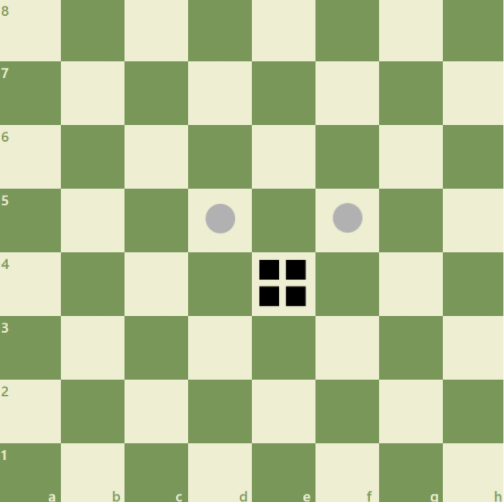
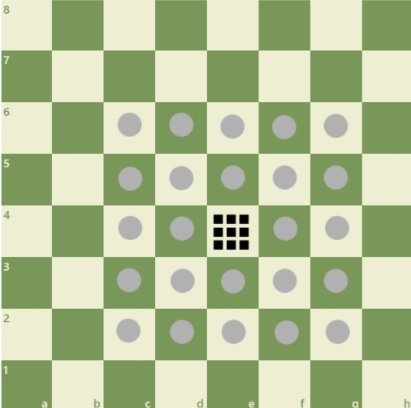
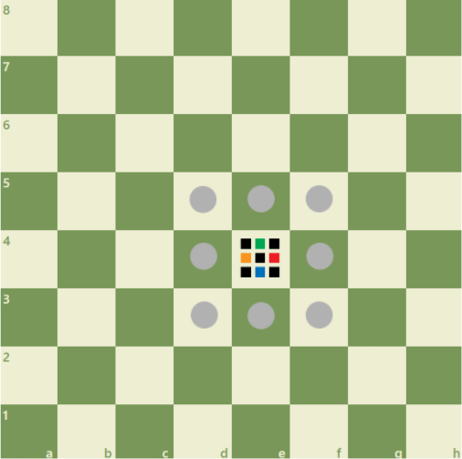
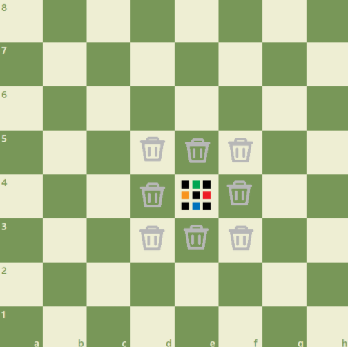
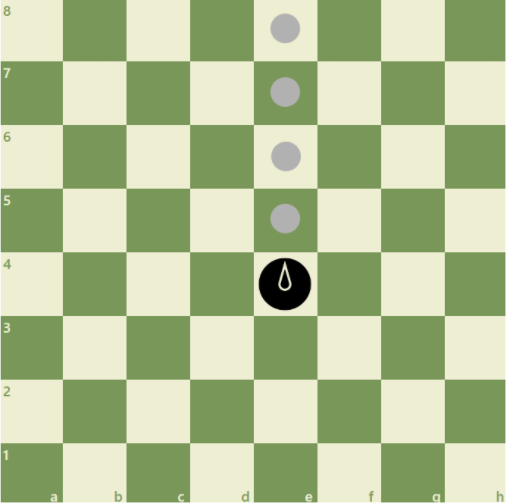
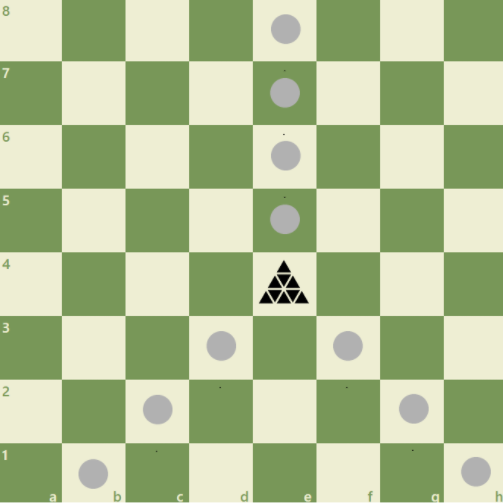
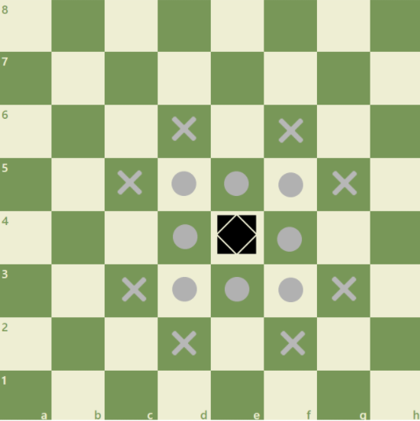
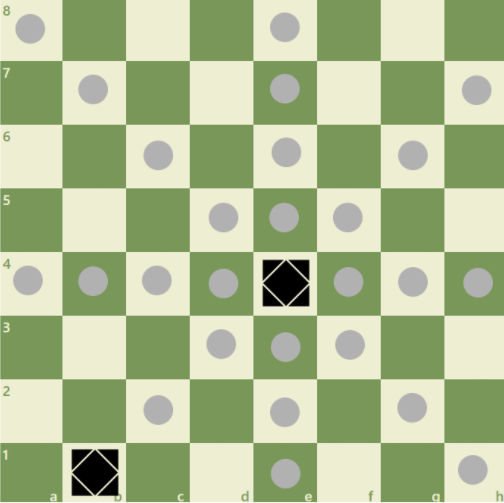
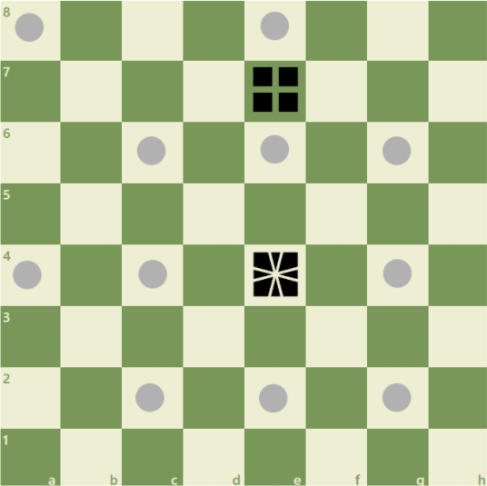

# Even Better Chess

*Game made by myself*

## 2x2

*The 2x2 can move and take diagonally in front of it.*

## 3x3

**The 3x3 has two states**

### Solved

*The 3x3 solved can move two squares in any way. He can't take.*

### Scrambled

*The 3x3 scrambled can move like the king in normal chess.*

*The 3x3 scrambled can delete any opponent's pawn. When he deletes a pawn, he doesn't move.*

## Clock

*The clock can move on a line according to its orientation. After the clock has been played, it is forced to change its orientation. It takes as it moves*

## Pyraminx

*The pyraminx can move in front of him and diagonally backwards. It takes as it moves*

## Skewb

**The skewb has to states**

### Not aligned with the allied skewb

*The skewb can move like the king. It takes like the knight in normal chess.*

### Aligned with the allied skewb

*The skewb can move and can take like the queen in normal chess*

## Square-1

*The square-1 can move like the queen in normal chess but every other square, can pass over the allied pieces. It takes as it moves*
